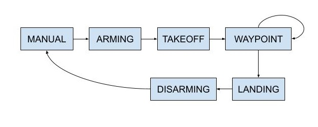

# Backyard Flyer

## Demonstration

Video demonstration

## Overview

This project is to navigate a quadrotor to perform a "square" move in the air. The waypoints are simple square at a certain altitude. The control and estimation parts are not implemented in this project but pre-implemented in [Udacidrone](https://udacity.github.io/udacidrone/) API. The simulator used in this project can be downloaded on [FCND-Simulator](https://github.com/udacity/FCND-Simulator-Releases/releases).

## Build Instruction

To run this project, additional resources are required as follows:

- Download [Udacity FCND Simulator](https://github.com/udacity/FCND-Simulator-Releases/releases)
- Follow the instruction [Starter-Kit](https://github.com/udacity/FCND-Term1-Starter-Kit) to set up propriate environment.
- Switch to `fcnd` environment by `$ source activate fcnd`

After installing, start the simulator and run BACKYARD FLYER. Run python code by

`python backyard_flyer.py`

One should be able to see the quadrotor moving as desired.

If one would like to fly its quadrotor with the code, run 

`python backyard_flyer_robot.py`

## Project Detail

The backyard_flyer.py file is event driven programming code. Functions are called when new position, velocity or state of the quadrotor is received, which are described as:

- `MsgID.LOCAL_POSITION`: updates the `self.local_position` attribute
- `MsgID.LOCAL_VELOCITY`: updates the `self.local_velocity` attribute
- `MsgID.STATE`: updates the `self.guided` and `self.armed` attributes

Besides, the code uses a finite state machine to control the drone's states. These states and their relationship are:

