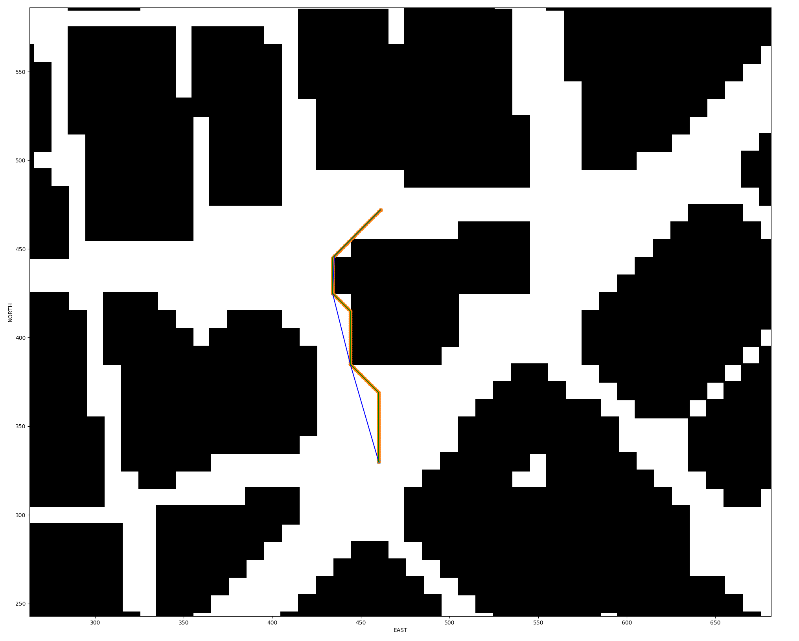

# 3D Motion Planning
## Video Demonstration

## Overview

In this project, the quadrotor will use motion planning techniques to plan a path through an urban environment. 

## Build Instruction

To run this project, additional resources are required as follows:

- Download [Udacity FCND Simulator](https://github.com/udacity/FCND-Simulator-Releases/releases)
- Follow the instruction [Starter-Kit](https://github.com/udacity/FCND-Term1-Starter-Kit) to set up propriate environment.
- Switch to `fcnd` environment by `$ source activate fcnd`

After installing, start the simulator and run MOTION PLANNING. Run python code by

`python motion_planning.py`

One should be able to see the quadrotor lifting, spending some time planning and moving following a planned path.

One could also set his own goal by

`python motion_planning.py -g "(-122.397249, 37.793893, 0)"`

## Project Detail

The key functionality of the motion planning is included in files `motion_planning.py` and `planning_tils.py`

#### planning_utils

This file contains useful helper functions for motion planning. 

`create_grid` creates a discretized configuration space based on the obstacle data, safety distance and desired flying altitude.

`a_star` searches for a path with least cost. Eight valid motions, including diagonal motions are included during the planning process.

`prune_path` prunes the original path and returns a shorter path by using collinear check and Bresenham algorithm.

#### motion_planning

Most part of the code is similar to the first project, which is not discussed here. The main motion planning algorithm is written in the method `plan_path` of class `MotionPlanning`.

The steps of planning a path is as follows.

- Load the 2.5D map in the `colliders.csv` file describing the environment.
- Discretize the environment into a grid representation.
- Define the start and goal locations with respect to grid frame. 
- Perform a search using A*. 
- Use a collinearity test and a ray tracing method (Bresenham) to remove unnecessary waypoints.
- Return waypoints in local ECEF coordinates (format for `self.all_waypoints` is [N, E, altitude, heading], where the drone’s start location corresponds to [0, 0, 0, 0]). 

The found path represented in a 2D map is shown below.

| Path        | Nodes Number | Color  |
| ----------- | ------------ | ------ |
| A* path     | 143          | Orange |
| Pruned path | 5            | Blue   |

